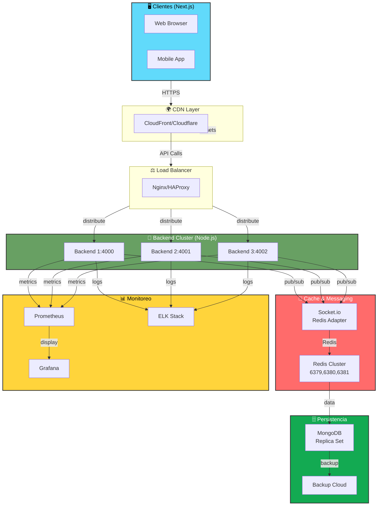
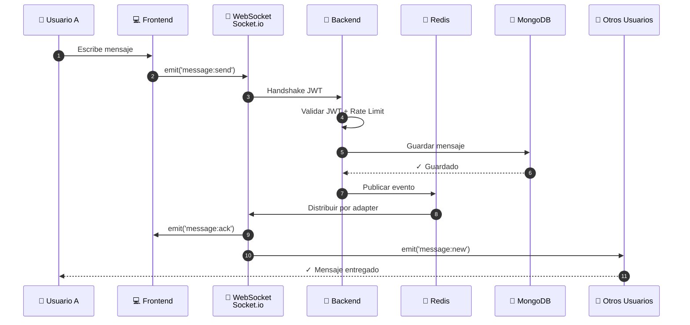
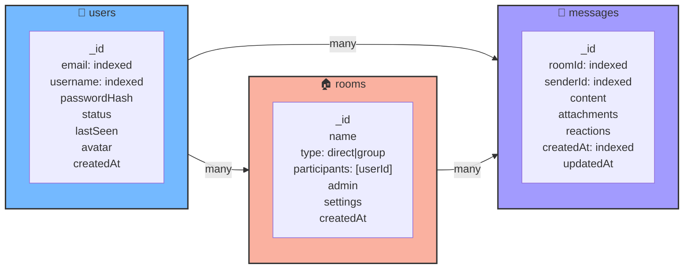
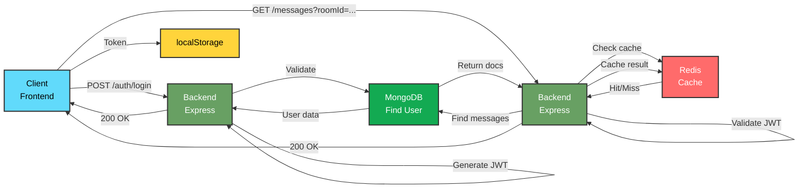
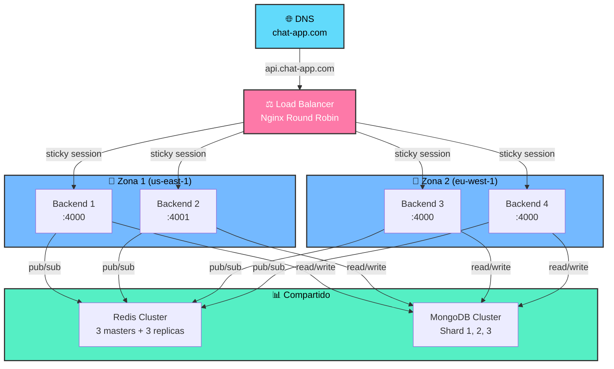
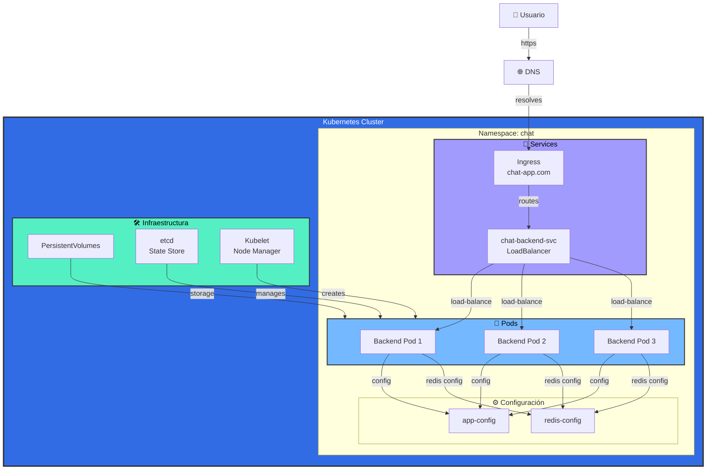

# 📊 Diagrama de Arquitectura - Versión Detallada

## 1. Arquitectura General del Sistema



---

## 2. Flujo WebSocket (Real-Time)



---

## 3. Ciclo de Vida de Conexión

```mermaid
stateDiagram-v2
    [*] --> Disconnected

    Disconnected --> Connecting: socket.connect()

    Connecting --> Authenticating: TCP connection
    Authenticating --> Connected: JWT válido
    Authenticating --> AuthError: Token inválido
    AuthError --> Disconnected: Reconectar

    Connected --> Idle: Esperar evento
    Idle --> Message: Usuario envía msg
    Message --> Idle: Mensaje procesado

    Idle --> Typing: Usuario escribe
    Typing --> Idle: Deja de escribir

    Idle --> Disconnecting: Usuario cierra app<br/>o se desconecta
    Disconnecting --> Disconnected: Socket cerrado

    Idle --> ReconnectDelay: Error temporal
    ReconnectDelay --> Connecting: Reintento (backoff)

    note right of Connected
        Estado activo:
        - Escuchando eventos
        - Emitiendo eventos
        - Redis conectado
        - Presente en DB
    end

    note right of Disconnected
        Estado inactivo:
        - Token NO guardado en memoria
        - Sesión limpiada
        - Conexión cerrada
    end
```

---

## 4. Estructura de Datos - MongoDB Collections



---

## 5. Redis Key Structure

```
┌─ Sesiones ─────────────────┐
│ user:{userId}:token        │  → JWT token (TTL: 24h)
│ user:{userId}:socket_id    │  → ID de conexión actual
│ user:{userId}:online       │  → true | false
│ user:{userId}:last_seen    │  → timestamp
└────────────────────────────┘

┌─ Presencia ─────────────────┐
│ online_users               │  → Set[userId]
│ presence:{userId}          │  → { status, timestamp }
└────────────────────────────┘

┌─ Rate Limiting ─────────────┐
│ ratelimit:{userId}         │  → count (TTL: 60s)
│ ratelimit:{ipAddress}      │  → count (TTL: 60s)
└────────────────────────────┘

┌─ Caché ─────────────────────┐
│ messages:{roomId}:recent   │  → [msg] (TTL: 1h)
│ user:{userId}:data         │  → { name, avatar } (TTL: 30m)
└────────────────────────────┘

┌─ Pub/Sub Channels ──────────┐
│ room:{roomId}:messages     │  → Nueva publicación
│ user:{userId}:notify       │  → Notificaciones
│ presence:updates           │  → Cambios online/offline
└────────────────────────────┘
```

---

## 6. Request/Response Cycle (REST)



---

## 7. Escalabilidad - Distribución de Carga



---

## 8. Arquitectura Kubernetes



---

## 9. CI/CD Pipeline

```mermaid
graph LR
    DEV["👨‍💻 Developer<br/>Commit Code"]
    GIT["📦 Git<br/>Repository"]
    CI["🔄 CI/CD<br/>GitHub Actions"]

    TEST["✅ Tests<br/>Unit & E2E"]
    BUILD["🔨 Build<br/>Docker Image"]
    PUSH["📤 Push<br/>Registry"]

    STAGE["🎭 Staging<br/>Deploy"]
    PROD["🚀 Production<br/>Deploy"]

    MONITOR["📊 Monitor<br/>Prometheus/Grafana"]

    DEV -->|git push| GIT
    GIT -->|webhook| CI
    CI -->|run tests| TEST
    TEST -->|success| BUILD
    BUILD -->|docker build| PUSH
    PUSH -->|image ready| STAGE
    STAGE -->|manual approve| PROD
    PROD -->|running| MONITOR

    style DEV fill:#61dafb,stroke:#333,stroke-width:2px,color:#000
    style GIT fill:#fd79a8,stroke:#333,stroke-width:2px,color:#fff
    style CI fill:#fdcb6e,stroke:#333,stroke-width:2px,color:#000
    style TEST fill:#00b894,stroke:#333,stroke-width:2px,color:#fff
    style BUILD fill:#0984e3,stroke:#333,stroke-width:2px,color:#fff
    style PUSH fill:#6c5ce7,stroke:#333,stroke-width:2px,color:#fff
    style STAGE fill:#fdcb6e,stroke:#333,stroke-width:2px,color:#000
    style PROD fill:#d63031,stroke:#333,stroke-width:2px,color:#fff
    style MONITOR fill:#00b894,stroke:#333,stroke-width:2px,color:#fff
```



---

## 10. Matriz de Tecnologías

| Capa              | Tecnología        | Función                 | Alternativas                    |
| ----------------- | ----------------- | ----------------------- | ------------------------------- |
| **Frontend**      | Next.js 16        | UI Framework            | React, Vue, Svelte              |
| **Frontend**      | Tailwind CSS      | Styling                 | Bootstrap, Material-UI          |
| **Frontend**      | Socket.io Client  | WebSocket Client        | ws, reconnecting-websocket      |
| **Backend**       | Node.js + Express | HTTP Server             | Python/FastAPI, Go, Java/Spring |
| **Backend**       | TypeScript        | Type Safety             | JavaScript, Go                  |
| **Backend**       | Socket.io         | WebSocket Server        | ws, Fastify-websocket           |
| **Auth**          | JWT               | Token Auth              | OAuth2, Session-based           |
| **Auth**          | bcrypt            | Password Hashing        | argon2, scrypt                  |
| **Cache**         | Redis             | Cache/PubSub            | Memcached, RabbitMQ             |
| **Database**      | MongoDB           | NoSQL DB                | PostgreSQL, MySQL, Cassandra    |
| **Queue**         | RabbitMQ          | Message Queue           | Kafka, AWS SQS                  |
| **Container**     | Docker            | Containerization        | Podman, containerd              |
| **Orchestration** | Kubernetes        | Container Orchestration | Docker Swarm, Nomad             |
| **CI/CD**         | GitHub Actions    | Automation              | GitLab CI, Jenkins              |
| **Monitoring**    | Prometheus        | Metrics                 | Datadog, New Relic              |
| **Logging**       | ELK Stack         | Logs                    | Splunk, Cloudwatch              |

---

## 11. Roadmap de Desarrollo

```mermaid
timeline
    title Roadmap - Real-Time Chat

    section Mes 1: MVP
        Semana 1: Auth básica
        Semana 2: Chat en tiempo real
        Semana 3: Presencia online
        Semana 4: Deploy inicial

    section Mes 2: Features
        Semana 5: Historial mensajes
        Semana 6: Múltiples salas
        Semana 7: Notificaciones
        Semana 8: Mobile responsive

    section Mes 3: Escalabilidad
        Semana 9: Redis Cluster
        Semana 10: Kubernetes deployment
        Semana 11: CDN setup
        Semana 12: Load testing

    section Mes 4: Production
        Semana 13: Monitoreo
        Semana 14: Seguridad audit
        Semana 15: Performance tuning
        Semana 16: Launch!
```

---

## 📌 Resumen

**Características Clave:**

- ✅ Real-time WebSocket communication
- ✅ Escalabilidad horizontal
- ✅ High availability con replicación
- ✅ Caching distribuido
- ✅ Message queue para async tasks
- ✅ Kubernetes-ready
- ✅ CI/CD automated
- ✅ Monitoreo completo

**Capacidad:**

- **Fase actual**: 1-100 usuarios
- **Producción pequeña**: 1K-50K usuarios
- **Producción media**: 50K-500K usuarios
- **Producción grande**: 500K+ usuarios (con escalabilidad continua)

Ver [SCALING.md](./SCALING.md) para detalles completos de escalabilidad.
